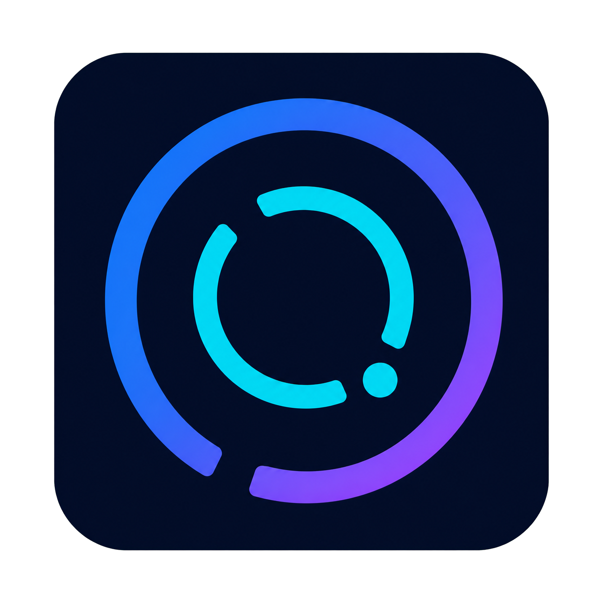

  

# CodexOrbit

### Windows Codex 用量实时悬浮窗 | 圆环监控 5h + 周额度

[简体中文](README.md) · [English](README_EN.md)

## 演示

## Quick Start

1. 从 [Releases](https://github.com/xxll569/CodexOrbit/releases/latest) 下载最新便携包。
2. **解压即用**：双击 `CodexOrbit.exe`，无需安装。
3. 先在 Codex 桌面端完成登录。CodexOrbit 会复用共享登录状态读取账号用量，并自动刷新。

支持 Windows 10/11；系统通常已内置所需的 .NET Framework 4.8 运行环境。

## 功能亮点

- **双额度圆环**：同时关注 5 小时额度与周额度，重置倒计时一目了然。
- **Mini 悬浮窗**：轻量常驻桌面，支持拖动、置顶和位置记忆。
- **边缘吸附**：靠近屏幕左右边缘时自动收成细长把手，悬停即可展开。
- **自动刷新**：定时同步账号用量，也可右键选择“重新读取”。
- **轻量直连**：复用 `%CODEX_HOME%\auth.json` 或 `%USERPROFILE%\.codex\auth.json` 中的 Codex 登录状态直接请求用量接口，无需额外安装 Codex CLI。
- **认证保护**：登录令牌仅在请求时读入内存；CodexOrbit 不复制、不刷新、不改写令牌，也不会将令牌写入诊断日志。

周额度显示在圆形仪表中；如果本地日志包含有效的 5 小时额度，左侧胶囊会自动显示额度和重置倒计时，否则只显示周额度圆环。新额度周期显示 100% 时会标记“新”，首次使用后继续刷新。

## Star History

如果 CodexOrbit 帮到了你，欢迎留下一个 ⭐ Star，让更多开发者发现它。

社区：[LINUX DO — 中文开发者社区](https://linux.do/)
