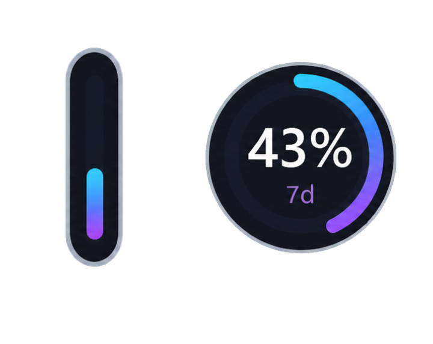

# Codex Orbit

[简体中文](README.md) | [English](README_EN.md)

A lightweight Windows usage overlay that displays your Codex five-hour and weekly quotas in a compact circular gauge.

## Preview

  

## Quick Start

1. Download the latest portable package from [Releases](https://github.com/xxll569/CodexOrbit/releases/latest).
2. Extract the package and run `CodexOrbit.exe`. Codex Orbit supports Windows 10 and 11, and the required runtime is usually already included with Windows, so no additional installation is needed.
3. Use Codex as usual. The gauge refreshes automatically after quota snapshots are written to your local logs.

- Hover over the overlay to view the sync status, reset time, and latest snapshot.
- A newly reset 100% quota is marked as new and notes that it will refresh after the first use.
- Drag the edge of the circular gauge to resize the overlay.
- Codex Orbit opens directly in the Mini gauge capsule; no other display modes are available.
- Drag the Mini overlay to reposition it. Codex Orbit remembers its last position automatically.
- Move the Mini overlay near the left or right edge of the screen to snap it into a slim handle; hover over the handle to expand it.
- Right-click the Mini overlay to reload usage data, toggle always-on-top, or exit.

The weekly quota appears in the circular gauge. If your local logs contain a valid five-hour quota, the capsule on the left also displays the quota and reset countdown; otherwise, only the weekly quota gauge is shown.

Codex Orbit only reads local quota logs from `%USERPROFILE%\.codex\sessions`. It does not read your account token.

### If Codex Orbit helps you, consider leaving a ⭐ Star so more developers can discover it.

### Community: [LINUX DO — Chinese Developer Community](https://linux.do/)
